## Title

Notes:
Hello, my name is Sébastien and I work at Criteo as a full stack engineer.
I am particularly attracted by UI developments and I spend a lot of time trying to catch up JavaScript evolution.
At work, I develop mostly with Angular but I like learning other libraries, frameworks and I especially like learning how to do tricky stuff in vanilla js.
I think that's a good way to learn what are other standards, how others develop, and gives inspiration and new ideas to use the right solution to a given problem.
That's exactly what I would like to share with you today. Learn some standards, explore some common practices and hopefully this might help when trying to design components for our favorite frameworks.

---


Notes:
Let's say you need to create basic UI components and you would like to share them between different projects.
Each project being implemented with various libraries or frameworks,
Like our favorite ones: React, Vue or Angular for example.

What can we do?

---


Notes:
One possibility is to write a spec...

---


Notes:
Implement it 3 times...

---


Notes:
With different implementation and inconsistent decisions...

---


Notes:
And each implementation evolve at its own speed so all are not up to date in the same time regarding the spec.

---


Notes:
Another possibility is to create a library using JQuery...

---


Notes:
And implement 3 wrappers...

---


Notes:
Removing jQuery 3 times...

---


Notes:
And once again each of those is updated at its own speed.

---


Notes:
Or...
You can rely on web standards!
Internally, Ionic rely on Stencil to build components and expose them in a way they can be used with React, Vue and Angular.
These components are exposed in the web standards way called...

---

# Web Components

Notes:
... Web Components!
During this talk, we won't dig too much into Stencil.
Instead we will see what are the Web Standards around Web Components,
how to use those directly and see how far we can go today in modern browser...

In pure vanilla js!

---

## Specifications

- Custom elements <!-- .element: class="fragment highlight-blue" -->
- Shadow DOM
- HTML templates
- ES modules

Notes:
Let's start by the standards. The Web Components consist of 4 specs: Custom elements, shadow DOM, HTML templates,
and sometimes ES modules is also included as being one of the Web Components standards.
We will run into each of those to understand the basics.
Then we will try to implement a real world example and see what are common pitfalls and common practices.

First: custom elements.

---

Autonomous custom elements

```js
class HelloWorld extends HTMLElement {
  connectedCallback() {
    this.innerHTML = '<h1>Hello, world!</h1>';
  }
}

customElements.define('hello-world', HelloWorld);
```

Notes:
With custom elements, web developers can create new HTML tags or customize built-in elements.
As the name implies, custom elements are HTML elements like div, section or article, but something we can name ourselves,
that are defined via a browser API.
When naming a custom element, you have to always put a dash in the name.
Browser vendors have committed not to create new built-in elements containing a dash in their names to prevent conflicts.
So in this example, we extend the standard HTMLElement to create a new class that will contain the semantics, behaviors and markup of our component.
Then we define a tag hello-world that will rely on this class.
By extending HTMLElement, we are creating what is called an "autonomous custom element".
In the connectedCallback lifecycle method, we can access the root of our custom element with the keyword 'this'.
And as for every built-in HTMLElement, we can read and write a lot of properties, like innerHTML in this example.

---

```html
<body>
  <hello-world></hello-world>

  <script>
    class HelloWorld extends HTMLElement {
      connectedCallback() {
        this.innerHTML = '<h1>Hello, World!</h1>';
      }
    }

    customElements.define('hello-world', HelloWorld);
  </script>
</body>
```

Notes:
Now to use this new custom element, we can just write the tag hello-world in the body of our HTML page and...

---

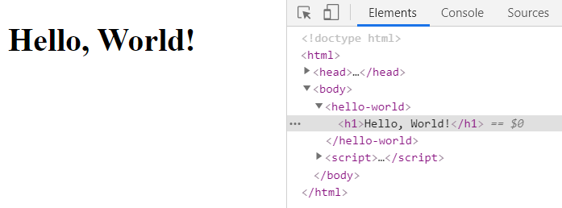

Notes:
...that's it!
The innerHTML has been updated with our "Hello, World!" message.

What happened exactly...

---

```html
<hello-world></hello-world>

<script>
  class HelloWorld extends HTMLElement {
    connectedCallback() {
      this.innerHTML = '<h1>Hello, World!</h1>';
    }
  }

  customElements.define('hello-world', HelloWorld);
</script>
```

Notes:
You might have noticed that our custom element is defined after being referenced in the html code.
Basically, what happened is that the browser tried first to render this tag as an empty inline element,
then the custom element was defined and the connectedCallback was executed, which rendered the "Hello, World!" message.
This process is called is called "element upgrade" and allows "progressive enhancement".
This can be usefull when async work has to be made before rendering your element, and yet having something rendered during this time.

---

Progressive enhancement

```html
<hello-world>Loading...</hello-world>

<script>
  setTimeout(() => {
    class HelloWorld extends HTMLElement {
      connectedCallback() {
        this.innerHTML = '<h1>Hello, World!</h1>';
      }
    }

    customElements.define('hello-world', HelloWorld);
  }, 5000);
</script>
```

Notes:
For example, if we put a content inside the hello-world tag, it will be rendered while the custom elements is being defined,
and then its innerHTML will be overridden by the "Hello, World!" message.

---

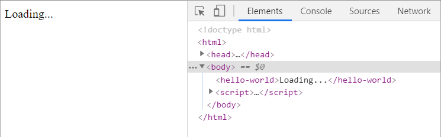

Notes:
In action!

Impressive right?

---

## Lifecycle hooks

- constructor
- connectedCallback
- disconnectedCallback
- attributeChangedCallback(attrName, oldVal, newVal) <!-- .element: class="fragment highlight-blue" -->
- adoptedCallback

Notes:
When implementing a custom element, you can define special lifecycle hooks.

- constructor is called when an instance of an element is created or upgraded.
- connectedCallback is called every time the element is inserted into the DOM.
- disconnectedCallback is called every time the element is removed from the DOM.
- attributeChangedCallback is called when an observed attribute has been added, removed, updated, or replaced.
  Also called for initial values when an element is created by the parser, or upgraded. Only attributes listed in the observedAttributes property will receive this callback.
- adoptedCallback is called when the custom element has been moved into a new document

Let's dig a bit more on how to observe changes to attributes.

---

Observing changes to attributes

```html
<hello-world who="Tech World"></hello-world>
```

<pre class="stretch"><code class="javascript">
class HelloWorld extends HTMLElement {
  constructor() {
    super();
    this.innerHTML = '<h1>Hello, <span id="wrapper"></span>!</h1>';
  }

  static get observedAttributes() {
    return ['who'];
  }

  attributeChangedCallback(name, oldValue, newValue) {
    if (name === 'who') {
      this.querySelector('#wrapper').innerHTML = newValue;
    }
  }
}
</code></pre>

Notes:
HTML attributes are a convenient way for users to declare initial state.
Elements can react to attribute changes by defining an attributeChangedCallback.
The browser will call this method for every change to attributes listed in the observedAttributes array.

---

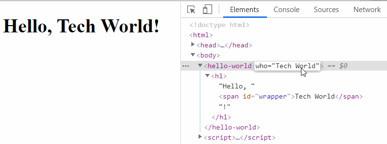

Notes:
Every change to the who attributes triggers a change to the wrapper content.

---

Reflecting properties

```js
h1.id = 'header';
h1.hidden = true;
```

to attributes

```html
<h1 id="header" hidden>Hello, World!</h1>
```

Notes:
Who knows what is the difference between properties and attributes?
Properties are basically JavaScript properties that are accessible on HTML element instances.
Attributes are what you can define in HTML markup.
You can access them in JavaScript with the getAttribute, hasAttribute and setAttribute methods on HTML element instances.
Properties can be any primitive or complexe type.
Attributes are always strings.
It's common for HTML properties to reflect their value back to the DOM as an HTML attribute.
For example, when the values of hidden or id are changed in JS,
the values are applied to the live DOM as attributes.
This is called "reflecting properties to attributes".
Almost every property in HTML does this. Why? Attributes are also useful for configuring an element declaratively and certain APIs like accessibility and CSS selectors rely on attributes to work.
Reflecting a property is useful anywhere you want to keep the element's DOM representation in sync with its JavaScript state. One reason you might want to reflect a property is so user-defined styling applies when JS state changes.

---

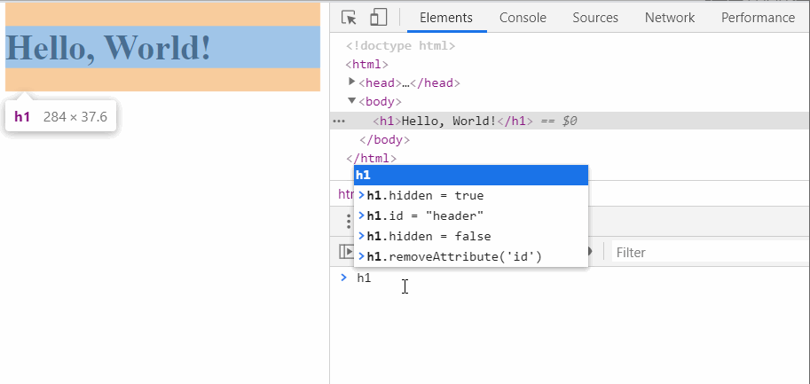

Notes:
You can see it in action here using the browser devtools.

---

```js
class HelloWorld extends HTMLElement {
  /* ... */

  get who() {
    return this.getAttribute('who');
  }

  set who(value) {
    this.setAttribute('who', value);
  }
}
```

Notes:
A common way to reflect properties to attributes is by wrapping getAttribute and setAttribute methods
to a getter and a setter.
This avoid us to store them in private variable and prevent the risk to have them desynchronized.

---

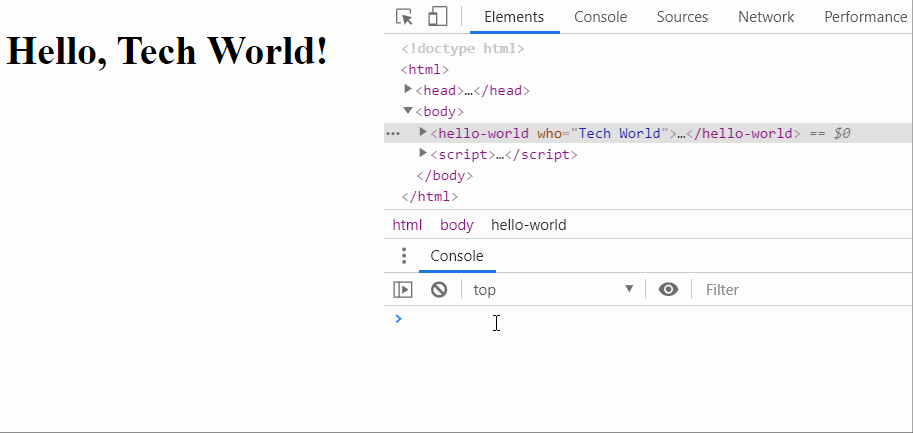

Notes:
If we get back to our hello world example, you can see that we can manipulate the attribute
by calling the getter and the setter.
When calling the setter, attributeChangedCallback is called and the content is updated.
Relying on getters and setters can make your life easier when implementing your own component.

---

Customized built-in elements

```html
<button is="customized-button">Click Me!</button>

<script>
  class CustomizedButton extends HTMLButtonElement {
    ...
  }

  customElements.define("customized-button", CustomizedButton,
                        { extends: "button" });
</script>
```

Notes:
Till now, we saw how to create new tags with what we called "autonomous custom elements".
It is also possible to customize built-in elements by extending it rather than extending HTMLElement,
and by adding the "extends" option when defining the element.

To add this kind of element in HTML markdown, you can't use it like before, with a customized-button tag.
Instead, you have to use a button element with the "is" attribute.

---


Notes:
As you can see in this figure, autonomous custom elements are currently supported by all major modern browsers.
Only customized built-in elements are not supported by Safari.
Polyfills exist for the unsupported features.

---

## Specifications

- Custom elements
- Shadow DOM <!-- .element: class="fragment highlight-blue" -->
- HTML templates
- ES modules

Notes:
Now we can define custom tags to embed our own component behavior,
Let's introduce the "Shadow DOM".

---

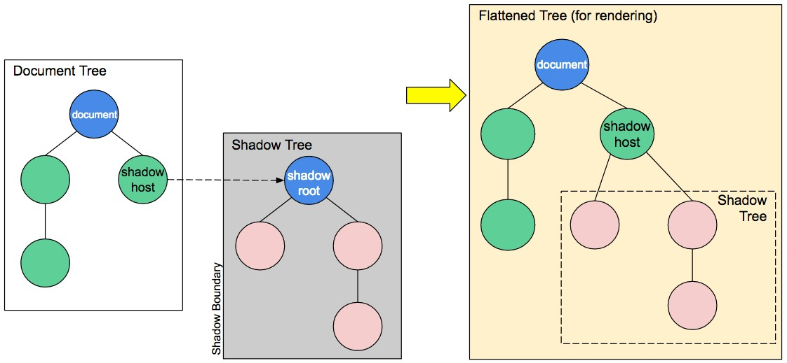

Notes:
The shadow DOM is an encapsulated version of the DOM.
This allows authors to effectively isolate DOM fragments, including anything that could be used as a CSS selector and the styles associated with them.
The shadow DOM allows hidden DOM trees to be attached to elements in the regular DOM tree.
This shadow DOM tree starts with a shadow root, which can be attached to any elements you want, in the same way as the normal DOM.
Generally, any content inside of the document’s scope is referred to as the light DOM, and anything inside a shadow root is referred to as the shadow DOM.

---

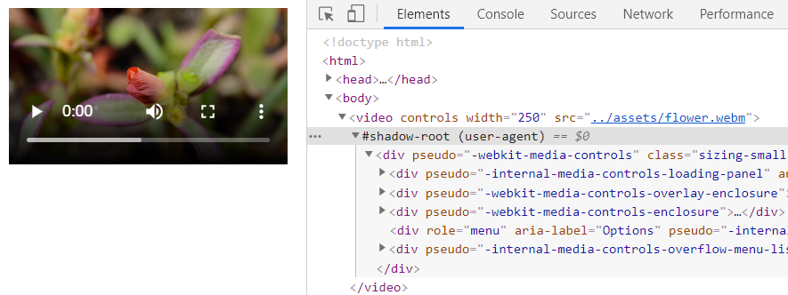

Notes:
Note that the shadow DOM is not a new thing by any means.
Browsers have used it for a long time to encapsulate the inner structure of an element.
Think for example of a "video" element, with the default browser controls exposed. All you see in the DOM is the video element, but it contains a series of buttons and other controls inside its shadow DOM.
The shadow DOM spec has made it so that you are allowed to actually manipulate the shadow DOM of your own custom elements.

---

```html
<span id="an-element"></span>

<script>
  const anElement = document.getElementById('an-element');
  const shadowRoot = anElement.attachShadow({ mode: 'open' });
  shadowRoot.innerHTML = '<h1>Hello, Shadow DOM!</h1>';
</script>
```

Notes:
Here is an example of how you can attach a shadow root so the element can gain its shadow DOM.
The mode "open" means that you can access the shadow DOM using JavaScript written in the main page context.
If you attach a shadow root to an element with mode closed, you won't be able to access the shadow DOM from the outside.
This is the case with built-in elements that contain shadow DOMs, such as <video>.

---

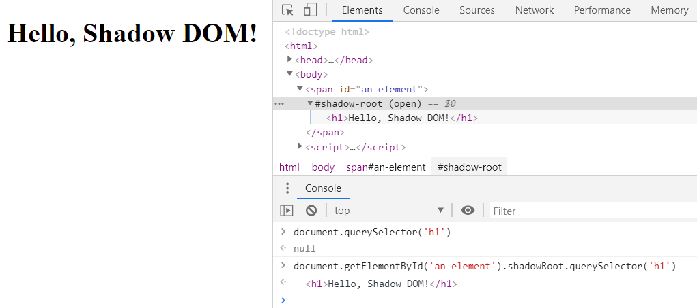

Notes:
This is what is rendered when running this example.
You can notice the shadow root in the browser devtools.
As you can also see in the browser console, CSS selectors cannot find something in a shadow root when it is called from the document.
Instead, you have to execute the CSS selector in the shadow root to find it.
You can also see another thing here: when attaching a shadow root to an element, calling the shadowRoot property into this element will return the shadow root.
Unless it was attached with mode closed.

---

```html
<style>
  h1 {
    background-color: orangered;
  }
</style>
```

```html
<hello-world></hello-world>
<h1>I am not green</h1>
```

```html
<script>
  class HelloWorld extends HTMLElement {
    constructor() {
      super();

      this.attachShadow({ mode: 'open' });
      this.shadowRoot.innerHTML = `
        <style>h1 { color: green; }</style>
        <h1>Hello, World!</h1>
      `;
    }
  }
  customElements.define('hello-world', HelloWorld);
</script>
```

Notes:
Shadow DOM is particularly useful when creating custom elements. Use shadow DOM to compartmentalize an element's HTML, CSS, and JS, thus producing a "web component".
Here is an example of a custom element that attaches shadow DOM to itself, encapsulating its DOM and CSS.

---

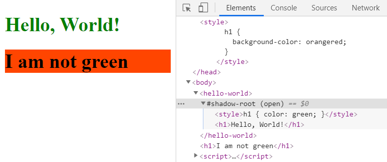

Notes:
This gives pretty much the same as the first hello world example with custom elements,
but here the component content appears in the element shadow DOM.
The orangered background color defined at document level does not traverse the shadow DOM,
And is not applied to the hello world component.
In the other hand, the green text color is scopped to the hello world shadow DOM.

---

Composition and slots

```html
<hello-world>Tech World</hello-world>

<script>
  class HelloWorld extends HTMLElement {
    constructor() {
      super();

      this.attachShadow({ mode: 'open' });
      this.shadowRoot.innerHTML = '<h1>Hello, <slot></slot>!</h1>';
    }
  }

  customElements.define('hello-world', HelloWorld);
</script>
```

Notes:
By default, if an element has shadow DOM, the shadow tree is rendered instead of the element's children.
To allow children to render, you need to add placeholders for them in your shadow tree.
This is when we should use slots.
In this example we used the slot element inside the shadow DOM.
The content of the hello-world tag when used in the HTML markup will be rendered inside this slot element.

---

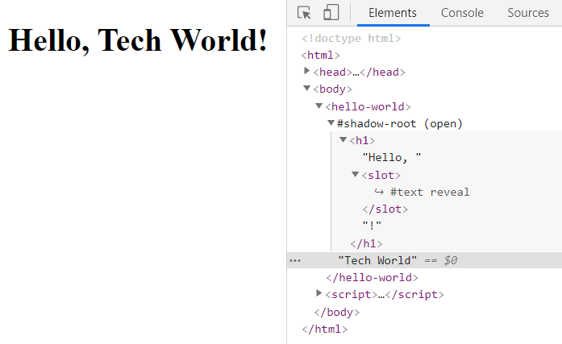

Notes:
You can see here that Tech World has been rendered between the comma and the exclamation mark.
You can also notice that the devtools show a text element inside the slot.
If you click reveal in the devtools, it will highlight the Tech world text element.
This is the difference between light DOM and shadow DOM, which we will see right now...

---

Light DOM

```html
<hello-world>
  <span>Hello</span>
  <span slot="who">Tech</span>
  <span slot="who">World</span>
</hello-world>
```

Shadow DOM

```js
this.shadowRoot.innerHTML = `
  <h1>
    <slot>Fallback content</slot>
    <i>
      <slot name="who"></slot>
    </i>
  </h1>
`;
```

Notes:
The markup a user of your component writes is called "light DOM". This DOM lives outside the component's shadow DOM.
It is the element's actual children.
When a component author writes shadow DOM, he can define how to render markup that's authored by the consumer of your component.
A user of your component can style the light DOM and this style will be applied.
Here is a more tricky example just so you can see what kind of things you can do.
A component can define zero or more slots in its shadow DOM. Slots can be empty or provide fallback content.
If the user doesn't provide light DOM content, the slot renders its fallback content.
You can also create named slots. Named slots are specific holes in your shadow DOM that users reference by name.
Now let's see what will happen...

---

Flattened DOM tree

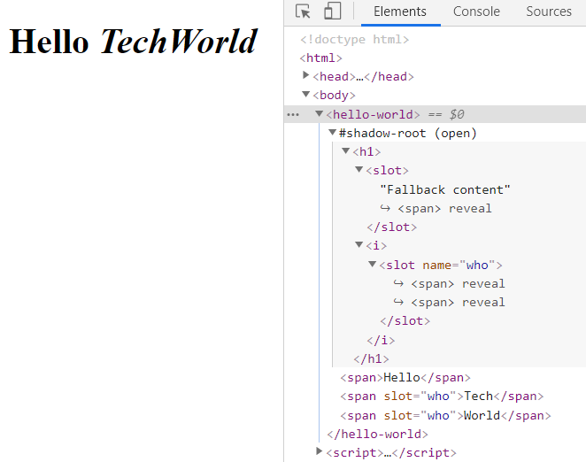

Notes:
Both words Tech and World have been concatenated into the same slot.
As the spans are rendered inside an italic tag, they rendered in italic.
The fallback content has been replaced with the span containing "hello".
